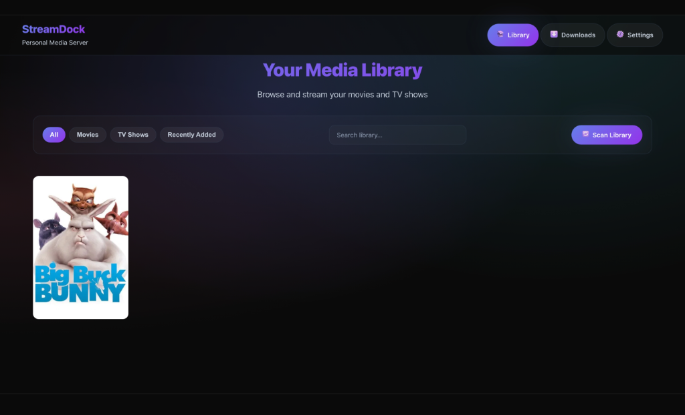
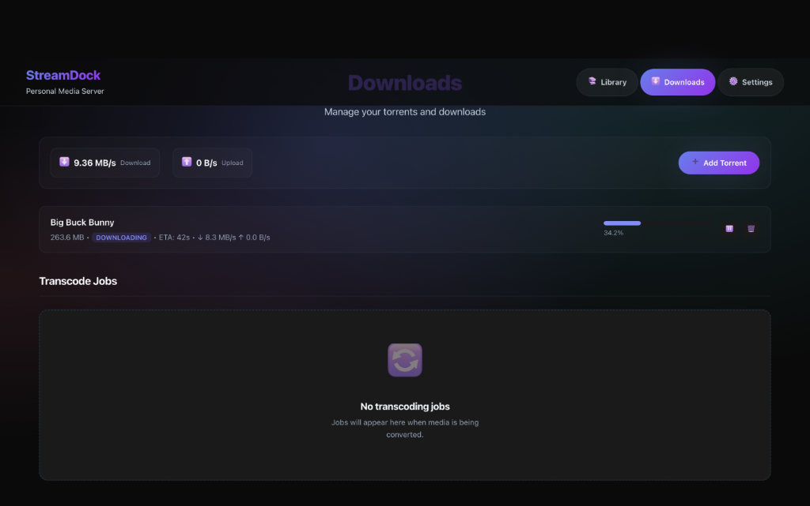
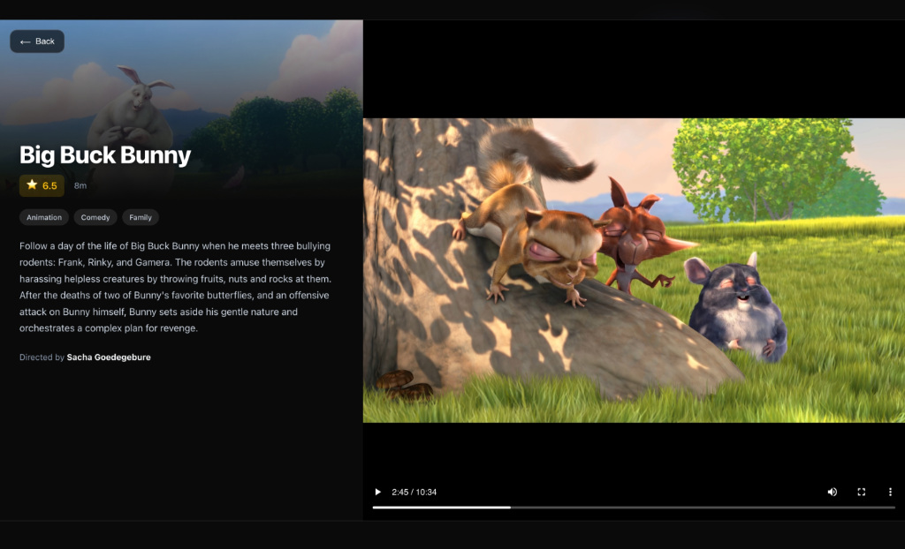
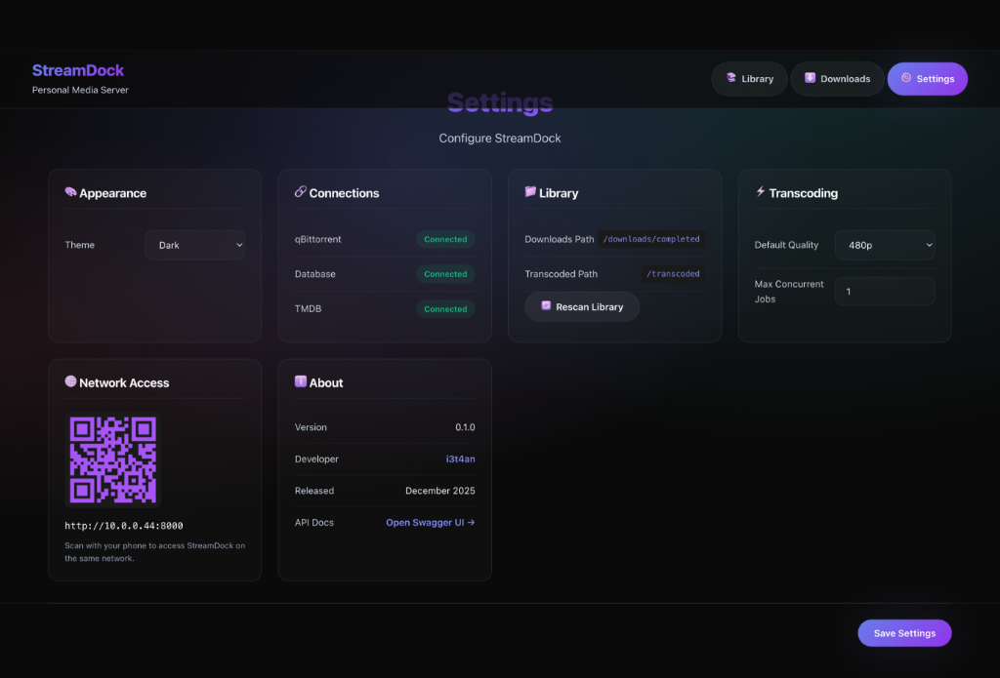

# StreamDock

*A self-hosted, containerized media platform unifying torrent management and streaming*

[](https://www.python.org)
[](https://fastapi.tiangolo.com)
[](https://www.docker.com)
[](LICENSE)

[Features](#features) • [Quick Start](#quick-start) • [Usage](#usage) • [Architecture](#architecture) • [API Reference](#api-reference) • [Configuration](#configuration) • [Troubleshooting](#troubleshooting)

---

**StreamDock** is a fully containerized media platform that combines torrent downloading with a Netflix-style streaming interface. Download media via magnet links, let it automatically fetch metadata and transcode to browser-compatible formats, then stream directly from your browser.

**Ethan You're a Lazy piece of %&^$** I hear you say - Yes I reused the same UI as the [Vector Knowledge Base](https://github.com/i3T4AN/Vector-Knowledge-Base) and my [Portfolio Website](https://i3t4an.github.io/), It saved me like 5 hours on designing, I like the design, and if it **Ain't broke don't fix it ¯\ _(ツ)_ /¯**

## Features

- **Netflix-Style Library** - Browse your media collection with auto-fetched posters and metadata from TMDB
- **Integrated Torrent Manager** - Add magnet links and monitor downloads from the same interface
- **Browser-Based Playback** - Stream any video format directly in your browser (MKV, AVI, MP4, MOV)
- **Background Transcoding** - Automatic conversion to browser-compatible MP4 (CPU-based, no GPU required)
- **TV Show Support** - Organized by seasons and episodes with automatic detection
- **Watch Progress Tracking** - Resume playback exactly where you left off
- **Fully Containerized** - One command deployment with Docker Compose


*Netflix-style library with auto-fetched posters and metadata*

## Quick Start

### Prerequisites

- Docker & Docker Compose
- TMDB API Key ([Get one free](https://www.themoviedb.org/settings/api))

### Installation & Startup

1. **Clone the repository**
   ```bash
   git clone https://github.com/i3T4AN/streamdock.git
   cd streamdock
   ```

2. **Run the startup script**

   **Windows:**
   Double-click `start.bat` or run:
   ```powershell
   .\start.bat
   ```

   **Mac/Linux:**
   ```bash
   chmod +x start.sh
   ./start.sh
   ```

   *First run will automatically execute setup and create your configuration.*

3. **Configure environment**
   The script will pause if it's your first run. Edit the created `.env` file to add your TMDB API key, then run the start script again.

4. **Access the interface**
   Navigate to `http://localhost:8000`

> [!TIP]
> First startup may take 1-2 minutes while containers initialize and the database is created.

**Managing the application:**
```bash
# View logs
docker-compose logs -f

# Stop all services
docker-compose down

# Rebuild after code changes
docker-compose up -d --build

# Reset database (fresh start)
docker-compose down
docker volume rm streamdock-database
docker-compose up -d
```

## Usage

### Adding Media

1. Navigate to the **Downloads** tab
2. Click **Add Torrent** and paste a magnet link
3. Monitor download progress in real-time
4. Once complete, media appears in **Library** automatically with poster and metadata


*Torrent downloads with real-time progress and speed indicators*

### Watching Media

1. Browse your **Library** (filter by Movies or TV Shows)
2. Click any poster to open the player
3. For TV shows, select the episode from the sidebar
4. Your progress is saved automatically every 10 seconds


*Video player with metadata sidebar and playback controls*

### Transcoding

Files that need conversion (MKV, AVI, etc.) are automatically queued for transcoding. You can:
- View job progress in the **Downloads** tab under "Transcode Jobs"
- Cancel or restart jobs using the action buttons
- Clear completed/failed jobs with the "Clear Finished" button

### Settings

Configure your StreamDock instance from the Settings page:
- View connection status for all services
- Set default transcoding quality
- Trigger manual library rescans

### Network Access

Access StreamDock from your phone or other devices on the same network:
1. Open the **Settings** page
2. Find the **Network Access** section with the QR code
3. Scan the QR code with your phone's camera
4. StreamDock opens in your mobile browser!

Your local IP is automatically detected during `./setup.sh` and stored in `.env`.


*Settings page with QR code for network access and connection status*

## Architecture

### System Overview

```
┌─────────────────────────────────────────────────────────────────┐
│                      Docker Compose                             │
├─────────────────┬─────────────────┬─────────────────────────────┤
│    FastAPI      │  qBittorrent    │       PostgreSQL            │
│   (Port 8000)   │  (Port 8080)    │       (Port 5432)           │
├─────────────────┴─────────────────┴─────────────────────────────┤
│            Shared Volumes: /downloads, /transcoded              │
└─────────────────────────────────────────────────────────────────┘
```

### Media Processing Pipeline

```
┌──────────┐    ┌───────────┐    ┌──────────┐    ┌──────────┐    ┌─────────┐
│  Magnet  │ -> │ qBittor-  │ -> │  Scanner │ -> │   TMDB   │ -> │ Library │
│   Link   │    │   rent    │    │ (guessit)│    │  Lookup  │    │   DB    │
└──────────┘    └───────────┘    └──────────┘    └──────────┘    └─────────┘
                                       │
                                       ▼
                              ┌──────────────┐    ┌──────────┐
                              │  Transcode   │ -> │  Stream  │
                              │   (FFmpeg)   │    │  (MP4)   │
                              └──────────────┘    └──────────┘
```

### Tech Stack

| Component | Technology |
|-----------|------------|
| Backend | Python 3.11+, FastAPI, SQLAlchemy |
| Frontend | Vanilla JavaScript (no build step) |
| Database | PostgreSQL 15 |
| Torrents | qBittorrent-nox (linuxserver/qbittorrent) |
| Transcoding | FFmpeg (CPU-only, libx264) |
| Metadata | TMDB API |
| Container | Docker Compose |

### Project Structure

```
/streamdock
├── docker-compose.yml      # Container orchestration
├── .env                    # Environment configuration
├── start.sh / start.bat    # Startup scripts (Mac/Linux & Windows)
├── setup.sh / setup.ps1    # First-run setup scripts
├── backend/
│   ├── Dockerfile          # Python container
│   ├── main.py             # FastAPI entry point
│   ├── database.py         # Database connection & sessions
│   ├── models.py           # SQLAlchemy models
│   ├── routes_*.py         # API endpoints
│   ├── transcoder.py       # FFmpeg wrapper (CPU-only)
│   ├── streamer.py         # Video streaming with range support
│   ├── job_worker.py       # Background job processor
│   ├── scheduler.py        # Scheduled task runner
│   ├── library_scanner.py  # Media detection & TMDB matching
│   ├── tmdb_client.py      # TMDB API integration
│   └── torrent_client.py   # qBittorrent API wrapper
├── frontend/
│   ├── index.html          # Library view
│   ├── downloads.html      # Torrent & transcode management
│   ├── settings.html       # Configuration & QR code access
│   ├── css/                # Stylesheets
│   └── js/                 # JavaScript modules
└── config/
    ├── qBittorrent.conf    # qBittorrent settings
    ├── qbittorrent-init.sh # Container initialization
    └── webhook.sh          # Download completion webhook
```

## API Reference

### Torrent Management

| Method | Endpoint | Description |
|--------|----------|-------------|
| `GET` | `/api/torrents` | List all torrents |
| `POST` | `/api/torrents` | Add magnet link |
| `GET` | `/api/torrents/{hash}` | Get torrent details |
| `POST` | `/api/torrents/{hash}/pause` | Pause torrent |
| `POST` | `/api/torrents/{hash}/resume` | Resume torrent |
| `DELETE` | `/api/torrents/{hash}` | Delete torrent |
| `GET` | `/api/torrents/stats` | Download/upload speeds |

### Library

| Method | Endpoint | Description |
|--------|----------|-------------|
| `GET` | `/api/library` | List all media |
| `GET` | `/api/library/movies` | List movies only |
| `GET` | `/api/library/shows` | List TV shows only |
| `GET` | `/api/library/{id}` | Get media details |
| `GET` | `/api/library/{id}/episodes` | Get episodes (TV) |
| `POST` | `/api/library/scan` | Trigger manual scan |
| `DELETE` | `/api/library/{id}` | Remove from library |

### Streaming

| Method | Endpoint | Description |
|--------|----------|-------------|
| `GET` | `/api/stream/{id}` | Stream media file |
| `GET` | `/api/stream/{id}/episode/{ep_id}` | Stream episode |

### Transcoding

| Method | Endpoint | Description |
|--------|----------|-------------|
| `GET` | `/api/transcode/jobs` | List all jobs |
| `GET` | `/api/transcode/jobs/{id}` | Get job status |
| `POST` | `/api/transcode/jobs` | Queue new job |
| `DELETE` | `/api/transcode/jobs/{id}` | Cancel job |
| `POST` | `/api/transcode/jobs/{id}/restart` | Restart job |
| `DELETE` | `/api/transcode/jobs/finished` | Clear completed/failed |

### Progress & Settings

| Method | Endpoint | Description |
|--------|----------|-------------|
| `GET` | `/api/progress/{media_id}` | Get watch position |
| `POST` | `/api/progress/{media_id}` | Update position |
| `GET` | `/api/settings` | Get all settings |
| `PUT` | `/api/settings` | Update settings |

## Configuration

### Environment Variables

Create a `.env` file from `.env.example`:

```env
# PostgreSQL Database
POSTGRES_USER=streamdock
POSTGRES_PASSWORD=your_secure_password
POSTGRES_DB=streamdock

# TMDB API (https://www.themoviedb.org/settings/api)
TMDB_API_KEY=your_tmdb_api_key

# qBittorrent Credentials
QBIT_USERNAME=admin
QBIT_PASSWORD=adminadmin

# Application Secret
SECRET_KEY=your_secret_key

# Network Access (auto-detected by setup script)
SERVER_IP=
```

### Transcoding Settings

The transcoder uses CPU-based encoding for maximum Docker compatibility:

| Encoder | Preset | Notes |
|---------|--------|---------|
| libx264 | ultrafast | Fast encoding, universal compatibility |

### File Extension Handling

Files are processed based on extension:
- **Direct play** (no transcode): `.mp4`, `.mov`, `.webm`
- **Requires transcode**: `.mkv`, `.avi`, `.wmv`, `.flv`, etc.

## Troubleshooting

### Container Won't Start

```bash
# Check container logs
docker-compose logs streamdock-app

# Verify all containers are running
docker-compose ps

# Restart all services
docker-compose down && docker-compose up -d
```

### qBittorrent Connection Failed

1. Ensure qBittorrent container is healthy:
   ```bash
   docker-compose logs streamdock-qbittorrent
   ```

2. Check credentials match `.env`:
   - Default: `admin` / `adminadmin`

3. Access qBittorrent WebUI directly: `http://localhost:8080`

### Media Not Appearing in Library

1. Verify download completed in qBittorrent
2. Trigger manual scan: **Settings → Rescan Library**
3. Check backend logs for TMDB lookup errors:
   ```bash
   docker-compose logs streamdock-app | grep -i tmdb
   ```

### Transcoding Stuck or Failed

1. Check available disk space
2. View job error message in UI
3. Restart the job using the restart button
4. Check FFmpeg logs:
   ```bash
   docker-compose logs streamdock-app | grep -i ffmpeg
   ```

### Video Won't Play

1. Wait for transcoding to complete (check progress in Downloads tab)
2. Ensure the browser supports the video format
3. Check browser console for errors (F12 → Console)

## License

MIT License - see [LICENSE](LICENSE) for details.

---

## Disclaimer

This software is for personal use with legally obtained media. Users are responsible for ensuring compliance with local laws regarding media acquisition and streaming.
